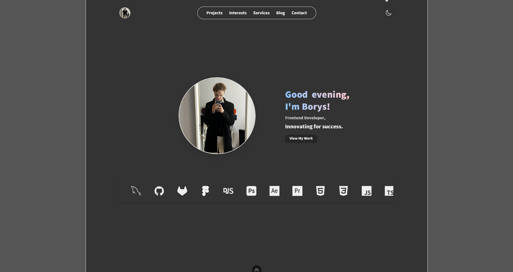

# borysbabas.dev, My Next-Gen Portfolio



This repository contains the source code for borysbabas.dev. The portfolio is built using **Nuxt 4**, **Vue 3**, and *
*Tailwind CSS 4**, showcasing projects fetched from GitHub, blog posts, skills, and personal information with beautiful
animations and interactive elements.

## Table of Contents

- [Features](#features)
- [Tech Stack](#tech-stack)
- [Setup Guides](#setup-guides)
- [Recommended IDE Setup](#recommended-ide-setup)
- [Project Setup](#project-setup)
- [Development](#development)
- [Production](#production)
- [Folder Structure](#folder-structure)
- [Key Features](#key-features)
- [Scripts](#scripts)
- [Credits](#credits)

## Features

**Dynamic GitHub Integration** - Automatically fetches and displays projects from GitHub with READMEs and images  
**Dark Mode Support** - Seamless theme switching with system preference detection  
**Blog System** - Content management powered by Nuxt Content  
**Built-in CMS** - Secure admin panel with MySQL database for managing blog posts and subscribers  
**Interactive UI** - Engaging animations and modal interactions  
**Lightning Fast** - Built with Nuxt 4 and Vite for optimal performance  
**Modern UI** - Tailwind CSS 4 with custom animations and transitions  
**Fully Responsive** - Mobile-first design approach

## Tech Stack

- **Framework**: [Nuxt 4](https://nuxt.com/) - Vue 3 meta-framework
- **Styling**: [Tailwind CSS 4](https://tailwindcss.com/) with Vite plugin
- **Content**: [Nuxt Content](https://content.nuxt.com/) - File-based CMS
- **Icons**: [Heroicons Vue](https://heroicons.com/)
- **Animations**: GSAP & custom CSS animations
- **Typography**: [@tailwindcss/typography](https://tailwindcss.com/docs/typography-plugin)
- **State Management**: VueUse for composable utilities

## Setup Guides

This project includes comprehensive setup and developer guides:

### [GitHub Token Setup Guide](docs/GITHUB_TOKEN_SETUP.md)

**Essential for GitHub API integration** - Learn how to create and configure a GitHub Personal Access Token to avoid
rate limiting when fetching repositories.

- Step-by-step token creation process
- Required scopes and permissions
- Environment variable configuration
- Rate limits: 60 requests/hour (without token) vs 5,000 requests/hour (with token)
- Security best practices

### [Sitemap Developer Guide](docs/SITEMAP_GUIDE.md)

**Complete sitemap system documentation** - Understand how the semi-automatic sitemap works and how to add new pages.

- Architecture overview (automatic blog discovery via Nuxt Content)
- Configuration reference for adding new pages
- Implementation examples for different page types
- Route processing and blog post pipelines
- Troubleshooting guide
- Quick reference for developers

## Recommended IDE Setup

[WebStorm](https://www.jetbrains.com/webstorm/) - Full-featured IDE with built-in Vue 3, TypeScript, and Nuxt support
out of the box.

## Project Setup

Install dependencies:

```bash
npm install
```

## Development

**Recommended**: Start the development environment with Mailpit (for testing contact form emails):

```bash
./dev-test.sh
```

This script will:

- Install and start Mailpit (if not already installed)
- Set up SMTP server on `localhost:2525`
- Open Mailpit web UI at `http://localhost:8025`
- Start Nuxt dev server on `http://localhost:3000`

**Or** start just the dev server without email testing:

```bash
npm run dev
```

## Production

Build the application for production:

```bash
npm run build
```

Locally preview production build:

```bash
npm run preview
```

Generate static site:

```bash
npm run generate
```

## Folder Structure

```
portfolio/
├── .env                       # Environment variables (not in git)
├── .env.example               # Example environment configuration
├── .gitignore                 # Git ignore rules
├── .node-version              # Node version specification
├── .nuxt/                     # Nuxt build directory (auto-generated)
├── .output/                   # Production build output
├── app.vue                    # Main app component
├── nuxt.config.ts             # Nuxt configuration
├── content.config.ts          # Nuxt Content configuration
├── tailwind.config.js         # Tailwind CSS configuration
├── tsconfig.json              # TypeScript configuration
├── package.json               # Dependencies and scripts
├── dev-test.sh                # Development testing script
├── README.md                  # Project documentation
├── GITHUB_TOKEN_SETUP.md      # GitHub API token setup guide
├── SITEMAP_GUIDE.md           # Dynamic sitemap developer guide
├── assets/
│   └── css/
│       ├── main.css           # Global styles
│       └── animations.css     # Custom animations
├── components/
│   ├── DetailModal.vue        # Modal component for interests
│   ├── EducationTrajectory.vue # Education timeline
│   ├── ExplodingImage.vue     # Interactive image component
│   ├── FadeInSection.vue      # Scroll animations
│   ├── Footer.vue             # Site footer
│   ├── Navbar.vue             # Navigation bar
│   ├── NavLinks.vue           # Navigation links
│   ├── PostCard.vue           # Blog post card
│   ├── SubscriptionForm.vue   # Newsletter subscription
│   ├── TechStack.vue          # Technology showcase
│   └── WorkExperience.vue     # Work history
├── composables/
│   ├── techStack.ts           # Tech stack data
│   ├── useEmailObfuscation.ts # Email obfuscation utility
│   ├── useGreeting.ts         # Dynamic greeting
│   ├── useIntroSequence.ts    # Intro animations
│   ├── useNavbarVisibility.ts # Navbar scroll behavior
│   ├── useRecaptcha.ts        # ReCAPTCHA integration
│   └── useRotatingTitles.ts   # Rotating title effect
├── content/
│   └── blog/                  # Markdown blog posts
│       ├── from-idea-to-interface.md
│       ├── how-i-started-coding.md
│       ├── keyboard-customisation.md
│       ├── perfect-portfolio.md
│       ├── vue-portfolio-build.md
│       └── working-with-clients.md
├── layouts/
│   └── default.vue            # Default layout
├── pages/
│   ├── index.vue              # Home page
│   ├── contact.vue            # Contact form
│   ├── interests.vue          # Personal interests with modal cards
│   ├── privacy.vue            # Privacy policy
│   ├── projects.vue           # Projects (GitHub integration)
│   ├── services.vue           # Services offered
│   ├── sitemap.vue            # Dynamic sitemap
│   ├── terms.vue              # Terms of service
│   └── blog/
│       ├── index.vue          # Blog listing
│       └── [slug].vue         # Dynamic blog post pages
├── public/
│   ├── favicon.ico
│   ├── robots.txt
│   ├── assets/
│   │   └── borys-cv.pdf       # Resume/CV
│   ├── fonts/
│   │   └── Pearl.ttf          # Custom font
│   └── img/                   # Images and thumbnails
│       ├── portfolio.png
│       ├── raadfxrd.jpeg
│       ├── companies/         # Company logos
│       ├── satelite/          # Personal photos
│       └── schools/           # Education institution logos
└── server/
    └── api/
        └── contact.post.ts    # Contact form API endpoint
```

## Key Features

### GitHub Projects Integration

The projects page automatically fetches repositories from GitHub (`raadfxrd`), extracts README content, and displays:

- First image from README as thumbnail
- Project title and description parsed from README
- Repository topics, stars, and language
- Links to live demos and source code

### Interactive Interests Page

Engaging modal-based interface:

- Click-to-reveal interest cards with smooth spinning animations
- Detailed information displayed in centered modals
- Heroicons integration for modern iconography
- Responsive design with backdrop blur effects

### Responsive Design

Mobile-first approach with breakpoints:

- Mobile: Base styles
- Tablet: `md:` prefix
- Desktop: `lg:` prefix

### Custom Animations

- Intro sequence with fade and scale effects
- Letter-by-letter text reveal
- Smooth page transitions
- Modal spinning animations with 3D transforms
- Hover effects and micro-interactions
- Exploding image gallery with satellites

### Dark Mode

Intelligent theme switching:

- Respects system preferences
- Manual toggle available
- Persistent across sessions
- Smooth transitions between modes

### Content Management

Blog posts written in Markdown with:

- Frontmatter metadata
- Automatic routing
- Syntax highlighting
- Typography optimization

## Scripts

### Development

- `npm install` - Install project dependencies
- `./dev-test.sh` - Start development environment with Mailpit for email testing (recommended)
- `npm run dev` - Start development server with hot-reload only
- `npm run build` - Build for production
- `npm run generate` - Generate static site
- `npm run preview` - Preview production build locally
- `npm run postinstall` - Prepare Nuxt (runs automatically)

### Database & CMS

- `npm run db:generate` - Generate database migrations from schema
- `npm run db:push` - Apply database migrations
- `npm run db:studio` - Open Drizzle Studio (visual database editor)
- `npm run db:init` - Create/update admin user directly via Drizzle ORM
- `npm run db:migration:admin` - Generate SQL migration for admin user from .env
- `npm run db:migration:apply` - Apply admin user migration to Supabase
- `npm run db:migration:admin:full` - Generate and apply admin migration (one command)

### Quick Start for CMS

```bash
# Option 1: One-command migration setup (Recommended for Supabase)
npm run db:migration:admin:full

# Option 2: Legacy method (Direct insert via ORM)
npm run db:setup

# Start development server
npm run dev

# Access CMS: Double-click ".dev" in footer or visit /admin/login
```

**Database**: PostgreSQL (Supabase) - See `.env` for connection details

## Credits

- **Icons**: [Heroicons](https://heroicons.com/) & [Devicon](https://devicon.dev/)
- **Framework**: [Nuxt Team](https://nuxt.com/) for the amazing meta-framework
- **Animations**: [GSAP](https://greensock.com/gsap/) for smooth animations
- **Styling**: [Tailwind CSS](https://tailwindcss.com/) for utility-first CSS
- **Content**: [Nuxt Content](https://content.nuxt.com/) for file-based CMS

---

**Built with ❤️ by Borys (Raadfxrd)**

Check out the [Nuxt documentation](https://nuxt.com/docs/getting-started/introduction) to learn more about the
framework.
